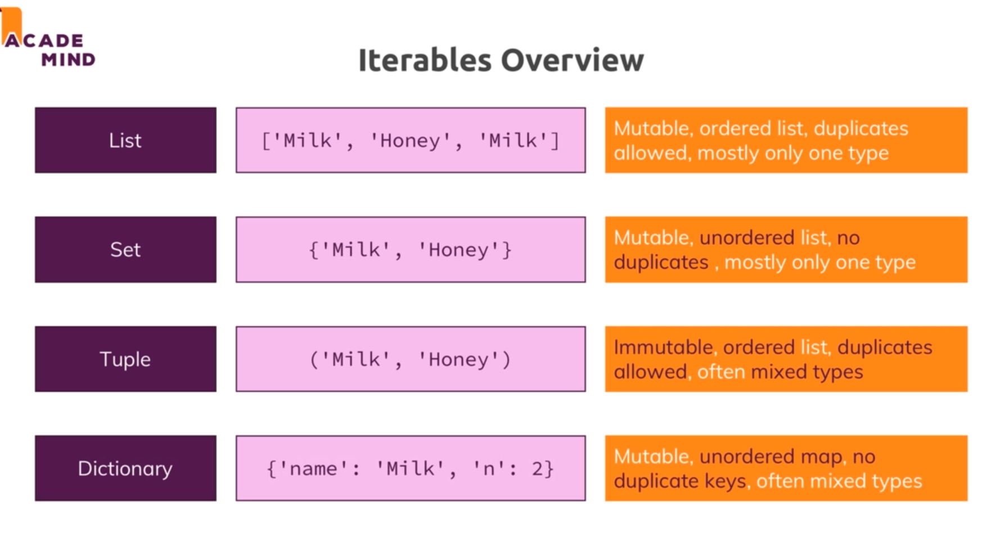

# python-revisited
## Iterables

## Docstring
https://www.datacamp.com/community/tutorials/docstrings-python

## Acknowledgement
https://www.rokomari.com/book/101763/python-porichiti

# Programming Paradign (Style of Programming)
## Procedural Programming
- Instructs a device on how to finish a task in logical steps
- Linear top down approach 
- Treats data and procedures (functions/ routines) in two different entities

## OOP Programming
- Encapsulating data and behaviour into objects.
### Five pillars of OOP
#### Encapsulation
- Objects group variables, which hold state, and methods that alter state
- Hiding a clien't internal data to prevent the client from directly accessing it (Client: Code outside of the class that uses the object)
- Name or variable that starts with '_' shouldn't be accessed outside of the class (It is private)
#### Abstraction
- 

- Polymorphism
- Inheritance

## Functional Programming
- Passing data from function to function to get result
- Functions are treated as data, you can use them as parameters, return them, build functions from other functions , and build custome functions
- Functions should be pure functions, they should avoid shred state, side effects and data should be immutable
- not dependent on local or global state